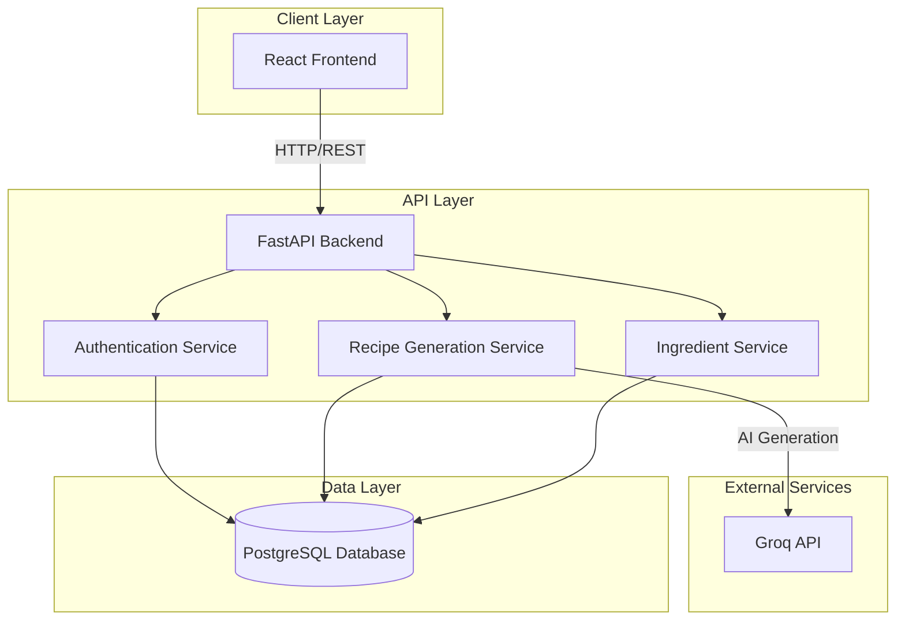

# Design Document

## Overview

The Ingredients-to-Recipe application is a full-stack web application built with a FastAPI backend, React frontend, and PostgreSQL database. The system leverages Groq's free AI API to dynamically generate recipe suggestions based on user-provided ingredients. The architecture features clear separation between the presentation layer (React), business logic layer (FastAPI), AI integration layer (Groq API), and data layer (PostgreSQL). Generated recipes are cached in the database for performance and to enable features like favorites, ratings, and shopping lists.

## Architecture

### High-Level Architecture



### Technology Stack

- **Frontend**: React 18+ with React Router for navigation, Axios for API calls, and CSS Modules for styling
- **Backend**: FastAPI with Pydantic for data validation, SQLAlchemy for ORM, and Alembic for migrations
- **AI Integration**: Groq API (free tier) with llama-3.3-70b-versatile model for recipe generation
- **Database**: PostgreSQL 14+ for caching generated recipes and storing user data
- **Authentication**: JWT tokens with httpOnly cookies
- **Deployment**: Docker containers for both frontend and backend

### System Components

1. **Frontend Application**: Single-page application (SPA) with component-based architecture
2. **API Gateway**: FastAPI application handling all HTTP requests
3. **Recipe Generation Service**: Integrates with Groq API to generate recipes using AI based on user ingredients
4. **Recipe Cache**: PostgreSQL database storing AI-generated recipes for reuse and performance
5. **Authentication Service**: User registration, login, and session management
6. **Ingredient Service**: Manages ingredient autocomplete and normalization

## Components and Interfaces

### Frontend Components

#### Component Hierarchy

```
App
├── HomePage
│   ├── IngredientInput
│   │   ├── AutocompleteInput
│   │   └── SelectedIngredientsList
│   └── PopularRecipes
├── RecipeResults
│   ├── FilterPanel
│   ├── RecipeCard (multiple)
│   └── Pagination
├── RecipeDetail
│   ├── IngredientList
│   ├── InstructionSteps
│   ├── RecipeMetadata
│   ├── RatingComponent
│   └── ShoppingListButton
├── UserProfile
│   ├── FavoriteRecipes
│   └── ShoppingList
└── AuthForms
    ├── LoginForm
    └── RegisterForm
```

#### Key Component Specifications

**IngredientInput Component**
- Props: `onIngredientsChange(ingredients: string[])`
- State: `selectedIngredients: string[]`, `inputValue: string`, `suggestions: string[]`
- Debounces autocomplete requests by 300ms
- Minimum 2 characters before triggering autocomplete

**RecipeCard Component**
- Props: `recipe: Recipe`, `availableIngredients: string[]`, `onClick: () => void`
- Displays: recipe name, image, cooking time, match percentage
- Visual indicator for ingredient match quality

**FilterPanel Component**
- Props: `onFilterChange(filters: FilterOptions)`
- State: `cookingTime: TimeRange`, `dietaryPreferences: string[]`
- Emits filter changes on user interaction

### Backend API Endpoints

#### Recipe Endpoints

```
POST /api/recipes/search
Request: { ingredients: string[], filters?: FilterOptions }
Response: { recipes: Recipe[], total: number }
```

```
GET /api/recipes/{recipe_id}
Response: Recipe
```

```
GET /api/recipes/popular
Query: ?limit=6
Response: { recipes: Recipe[] }
```

#### Ingredient Endpoints

```
GET /api/ingredients/autocomplete
Query: ?q=chicken&limit=10
Response: { suggestions: Ingredient[] }
```

```
GET /api/ingredients
Response: { ingredients: Ingredient[] }
```

#### User Endpoints

```
POST /api/auth/register
Request: { email: string, password: string }
Response: { user: User, token: string }
```

```
POST /api/auth/login
Request: { email: string, password: string }
Response: { user: User, token: string }
```

```
POST /api/users/favorites/{recipe_id}
Response: { success: boolean }
```

```
GET /api/users/favorites
Response: { recipes: Recipe[] }
```

```
POST /api/users/shopping-list
Request: { ingredients: string[] }
Response: { success: boolean }
```

```
GET /api/users/shopping-list
Response: { items: ShoppingListItem[] }
```

```
DELETE /api/users/shopping-list/{item_id}
Response: { success: boolean }
```

#### Rating Endpoints

```
POST /api/recipes/{recipe_id}/ratings
Request: { rating: number }
Response: { success: boolean, averageRating: number }
```

```
GET /api/recipes/{recipe_id}/ratings
Response: { averageRating: number, totalRatings: number, userRating?: number }
```

## Data Models

### Database Schema

```sql
-- Users table
CREATE TABLE users (
    id SERIAL PRIMARY KEY,
    email VARCHAR(255) UNIQUE NOT NULL,
    password_hash VARCHAR(255) NOT NULL,
    created_at TIMESTAMP DEFAULT CURRENT_TIMESTAMP,
    updated_at TIMESTAMP DEFAULT CURRENT_TIMESTAMP
);

-- Ingredients table
CREATE TABLE ingredients (
    id SERIAL PRIMARY KEY,
    name VARCHAR(100) UNIQUE NOT NULL,
    category VARCHAR(50) NOT NULL,
    synonyms TEXT[],
    created_at TIMESTAMP DEFAULT CURRENT_TIMESTAMP
);

-- Recipes table (stores AI-generated recipes)
CREATE TABLE recipes (
    id SERIAL PRIMARY KEY,
    name VARCHAR(255) NOT NULL,
    description TEXT,
    instructions JSONB NOT NULL,
    cooking_time_minutes INTEGER NOT NULL,
    difficulty VARCHAR(20) NOT NULL,
    serving_size INTEGER NOT NULL,
    image_url VARCHAR(500),
    nutritional_info JSONB,
    view_count INTEGER DEFAULT 0,
    source VARCHAR(50) DEFAULT 'groq_ai',
    cache_key VARCHAR(255),
    created_at TIMESTAMP DEFAULT CURRENT_TIMESTAMP,
    updated_at TIMESTAMP DEFAULT CURRENT_TIMESTAMP
);

CREATE INDEX idx_recipes_cache_key ON recipes(cache_key);

-- Recipe ingredients junction table
CREATE TABLE recipe_ingredients (
    id SERIAL PRIMARY KEY,
    recipe_id INTEGER REFERENCES recipes(id) ON DELETE CASCADE,
    ingredient_id INTEGER REFERENCES ingredients(id) ON DELETE CASCADE,
    quantity VARCHAR(50),
    unit VARCHAR(50),
    is_optional BOOLEAN DEFAULT FALSE,
    UNIQUE(recipe_id, ingredient_id)
);

-- Dietary tags table
CREATE TABLE dietary_tags (
    id SERIAL PRIMARY KEY,
    name VARCHAR(50) UNIQUE NOT NULL
);

-- Recipe dietary tags junction table
CREATE TABLE recipe_dietary_tags (
    recipe_id INTEGER REFERENCES recipes(id) ON DELETE CASCADE,
    tag_id INTEGER REFERENCES dietary_tags(id) ON DELETE CASCADE,
    PRIMARY KEY (recipe_id, tag_id)
);

-- User favorites table
CREATE TABLE user_favorites (
    user_id INTEGER REFERENCES users(id) ON DELETE CASCADE,
    recipe_id INTEGER REFERENCES recipes(id) ON DELETE CASCADE,
    created_at TIMESTAMP DEFAULT CURRENT_TIMESTAMP,
    PRIMARY KEY (user_id, recipe_id)
);

-- Shopping list table
CREATE TABLE shopping_list_items (
    id SERIAL PRIMARY KEY,
    user_id INTEGER REFERENCES users(id) ON DELETE CASCADE,
    ingredient_id INTEGER REFERENCES ingredients(id) ON DELETE CASCADE,
    quantity VARCHAR(50),
    unit VARCHAR(50),
    is_purchased BOOLEAN DEFAULT FALSE,
    created_at TIMESTAMP DEFAULT CURRENT_TIMESTAMP
);

-- Ratings table
CREATE TABLE recipe_ratings (
    id SERIAL PRIMARY KEY,
    user_id INTEGER REFERENCES users(id) ON DELETE CASCADE,
    recipe_id INTEGER REFERENCES recipes(id) ON DELETE CASCADE,
    rating INTEGER CHECK (rating >= 1 AND rating <= 5),
    created_at TIMESTAMP DEFAULT CURRENT_TIMESTAMP,
    updated_at TIMESTAMP DEFAULT CURRENT_TIMESTAMP,
    UNIQUE(user_id, recipe_id)
);

-- Indexes for performance
CREATE INDEX idx_ingredients_name ON ingredients(name);
CREATE INDEX idx_recipes_cooking_time ON recipes(cooking_time_minutes);
CREATE INDEX idx_recipe_ingredients_recipe ON recipe_ingredients(recipe_id);
CREATE INDEX idx_recipe_ingredients_ingredient ON recipe_ingredients(ingredient_id);
CREATE INDEX idx_user_favorites_user ON user_favorites(user_id);
CREATE INDEX idx_shopping_list_user ON shopping_list_items(user_id);
CREATE INDEX idx_recipe_ratings_recipe ON recipe_ratings(recipe_id);
```

### Pydantic Models (Backend)

```python
from pydantic import BaseModel, EmailStr
from typing import List, Optional
from datetime import datetime

class IngredientBase(BaseModel):
    name: str
    category: str
    synonyms: Optional[List[str]] = []

class Ingredient(IngredientBase):
    id: int
    created_at: datetime

class RecipeIngredient(BaseModel):
    ingredient_id: int
    ingredient_name: str
    quantity: str
    unit: str
    is_optional: bool
    is_available: bool

class Recipe(BaseModel):
    id: int
    name: str
    description: Optional[str]
    instructions: List[str]
    cooking_time_minutes: int
    difficulty: str
    serving_size: int
    image_url: Optional[str]
    nutritional_info: Optional[dict]
    ingredients: List[RecipeIngredient]
    dietary_tags: List[str]
    average_rating: Optional[float]
    total_ratings: int
    match_percentage: Optional[float]

class RecipeSearchRequest(BaseModel):
    ingredients: List[str]
    filters: Optional[dict] = {}

class UserCreate(BaseModel):
    email: EmailStr
    password: str

class UserLogin(BaseModel):
    email: EmailStr
    password: str

class User(BaseModel):
    id: int
    email: EmailStr
    created_at: datetime

class RatingCreate(BaseModel):
    rating: int

class ShoppingListItemCreate(BaseModel):
    ingredients: List[str]
```

### TypeScript Interfaces (Frontend)

```typescript
interface Ingredient {
  id: number;
  name: string;
  category: string;
}

interface RecipeIngredient {
  ingredient_id: number;
  ingredient_name: string;
  quantity: string;
  unit: string;
  is_optional: boolean;
  is_available: boolean;
}

interface Recipe {
  id: number;
  name: string;
  description?: string;
  instructions: string[];
  cooking_time_minutes: number;
  difficulty: string;
  serving_size: number;
  image_url?: string;
  nutritional_info?: Record<string, any>;
  ingredients: RecipeIngredient[];
  dietary_tags: string[];
  average_rating?: number;
  total_ratings: number;
  match_percentage?: number;
}

interface FilterOptions {
  cooking_time_range?: [number, number];
  dietary_preferences?: string[];
}

interface User {
  id: number;
  email: string;
}

interface AuthResponse {
  user: User;
  token: string;
}

interface ShoppingListItem {
  id: number;
  ingredient_name: string;
  quantity: string;
  unit: string;
  is_purchased: boolean;
}
```

## Recipe Generation with Groq API

### Generation Strategy

The application uses Groq's free API to generate recipes dynamically based on user ingredients. The system employs a caching strategy to improve performance and reduce API calls:

1. **Cache Check**: First check if recipes exist in database for the given ingredient combination
2. **AI Generation**: If no cached recipes, call Groq API to generate 3-5 recipe suggestions
3. **Parse & Store**: Parse AI response, store recipes in database with ingredients and metadata
4. **Filter & Sort**: Apply user filters (cooking time, dietary preferences) and sort by relevance
5. **Return Results**: Return recipes with match percentage and availability indicators

### Groq API Integration

**Model**: llama-3.3-70b-versatile (free tier)
**API Endpoint**: https://api.groq.com/openai/v1/chat/completions
**Rate Limits**: 30 requests/minute, 14,400 requests/day (free tier)

### Implementation Approach

```python
import json
from groq import Groq

async def generate_recipes(user_ingredients: List[str], filters: dict) -> List[Recipe]:
    # Normalize ingredient names
    normalized_ingredients = normalize_ingredients(user_ingredients)
    
    # Check cache first
    cache_key = create_cache_key(normalized_ingredients, filters)
    cached_recipes = await get_cached_recipes(cache_key)
    
    if cached_recipes:
        return cached_recipes
    
    # Generate recipes using Groq API
    client = Groq(api_key=os.getenv("GROQ_API_KEY"))
    
    prompt = build_recipe_prompt(normalized_ingredients, filters)
    
    response = client.chat.completions.create(
        model="llama-3.3-70b-versatile",
        messages=[
            {
                "role": "system",
                "content": "You are a professional chef assistant. Generate detailed recipes in JSON format."
            },
            {
                "role": "user",
                "content": prompt
            }
        ],
        temperature=0.7,
        max_tokens=2000,
        response_format={"type": "json_object"}
    )
    
    # Parse AI response
    recipes_data = json.loads(response.choices[0].message.content)
    
    # Store recipes in database
    recipes = []
    for recipe_data in recipes_data["recipes"]:
        recipe = await store_recipe(recipe_data, normalized_ingredients)
        recipes.append(recipe)
    
    # Cache results
    await cache_recipes(cache_key, recipes)
    
    return recipes

def build_recipe_prompt(ingredients: List[str], filters: dict) -> str:
    dietary_filter = ""
    if filters.get("dietary_preferences"):
        dietary_filter = f"All recipes must be {', '.join(filters['dietary_preferences'])}."
    
    time_filter = ""
    if filters.get("cooking_time_range"):
        min_time, max_time = filters["cooking_time_range"]
        time_filter = f"Cooking time should be between {min_time} and {max_time} minutes."
    
    prompt = f"""
Generate 3-5 diverse recipes using these ingredients: {', '.join(ingredients)}.

{dietary_filter}
{time_filter}

For each recipe, provide:
1. Recipe name
2. Brief description
3. Complete ingredient list with quantities and units
4. Step-by-step instructions
5. Cooking time in minutes
6. Difficulty level (easy, medium, hard)
7. Serving size
8. Dietary tags (vegetarian, vegan, gluten-free, etc.)

Format the response as JSON with this structure:
{{
  "recipes": [
    {{
      "name": "Recipe Name",
      "description": "Brief description",
      "ingredients": [
        {{"name": "ingredient", "quantity": "1", "unit": "cup", "is_optional": false}}
      ],
      "instructions": ["Step 1", "Step 2"],
      "cooking_time_minutes": 30,
      "difficulty": "easy",
      "serving_size": 4,
      "dietary_tags": ["vegetarian"]
    }}
  ]
}}

Prioritize recipes that use most of the provided ingredients.
"""
    return prompt
```

### Caching Strategy

- **Cache Key**: Hash of sorted ingredients + filters
- **Cache Duration**: 7 days for generated recipes
- **Cache Invalidation**: Manual invalidation when recipe is updated
- **Popular Recipes**: Most viewed recipes cached separately with 5-minute TTL

### Ingredient Normalization

- Convert to lowercase
- Handle common synonyms (e.g., "tomato" and "tomatoes")
- Trim whitespace
- Remove special characters

## Authentication and Security

### JWT Authentication Flow

1. User submits credentials to `/api/auth/login`
2. Backend validates credentials against hashed password in database
3. Backend generates JWT token with user ID and expiration
4. Token sent to client in httpOnly cookie
5. Client includes cookie in subsequent requests
6. Backend middleware validates token on protected routes

### Security Measures

- Passwords hashed using bcrypt with salt rounds of 12
- JWT tokens expire after 7 days
- httpOnly cookies prevent XSS attacks
- CORS configured to allow only frontend origin
- SQL injection prevented by SQLAlchemy parameterized queries
- Rate limiting on authentication endpoints (5 attempts per 15 minutes)
- Input validation using Pydantic models

## Error Handling

### Backend Error Handling

```python
from fastapi import HTTPException, status

# Custom exception handlers
@app.exception_handler(ValueError)
async def value_error_handler(request, exc):
    return JSONResponse(
        status_code=400,
        content={"detail": str(exc)}
    )

@app.exception_handler(SQLAlchemyError)
async def database_error_handler(request, exc):
    logger.error(f"Database error: {exc}")
    return JSONResponse(
        status_code=500,
        content={"detail": "A database error occurred"}
    )

# Standard error responses
class ErrorResponse(BaseModel):
    detail: str
    error_code: Optional[str]
```

### Frontend Error Handling

```typescript
// API client with error handling
class ApiClient {
  async request<T>(url: string, options: RequestInit): Promise<T> {
    try {
      const response = await fetch(url, options);
      
      if (!response.ok) {
        const error = await response.json();
        throw new ApiError(error.detail, response.status);
      }
      
      return await response.json();
    } catch (error) {
      if (error instanceof ApiError) {
        throw error;
      }
      throw new ApiError('Network error occurred', 0);
    }
  }
}

// Error boundary component
class ErrorBoundary extends React.Component {
  state = { hasError: false, error: null };
  
  static getDerivedStateFromError(error) {
    return { hasError: true, error };
  }
  
  render() {
    if (this.state.hasError) {
      return <ErrorDisplay error={this.state.error} />;
    }
    return this.props.children;
  }
}
```

### Error Messages

- **No recipes found**: "We couldn't find any recipes with those ingredients. Try adding more ingredients or removing some filters."
- **Network error**: "Unable to connect to the server. Please check your internet connection and try again."
- **Authentication error**: "Invalid email or password. Please try again."
- **Empty ingredients**: "Please add at least one ingredient to search for recipes."
- **Server error**: "Something went wrong on our end. Please try again in a moment."

## Performance Optimization

### Backend Optimization

- Database connection pooling (min: 5, max: 20 connections)
- Query optimization with proper indexes
- Eager loading of related data to avoid N+1 queries
- Recipe caching to minimize Groq API calls (7-day TTL)
- Response caching for popular recipes (5-minute TTL)
- Pagination for recipe results (20 recipes per page)
- Rate limiting for Groq API calls to stay within free tier limits

### Frontend Optimization

- Code splitting by route
- Lazy loading of recipe images
- Debounced autocomplete requests (300ms)
- Memoization of expensive computations using React.memo
- Virtual scrolling for long recipe lists
- Service worker for offline capability (future enhancement)

### Database Optimization

- Composite indexes on frequently queried columns
- Materialized view for popular recipes (refreshed daily)
- Full-text search index on recipe names and descriptions
- Partitioning of ratings table by date (future enhancement)

## Testing Strategy

### Backend Testing

**Unit Tests**
- Test recipe generation prompt building
- Test recipe parsing from Groq API response
- Test caching logic (cache hit/miss scenarios)
- Test authentication service (registration, login, token validation)
- Test ingredient normalization and synonym handling
- Test Pydantic model validation

**Integration Tests**
- Test API endpoints with database interactions
- Test Groq API integration with mock responses
- Test authentication flow end-to-end
- Test recipe generation and caching flow
- Test user favorites and shopping list operations

**Test Tools**: pytest, pytest-asyncio, httpx for async testing

### Frontend Testing

**Unit Tests**
- Test individual components in isolation
- Test utility functions (ingredient normalization, formatting)
- Test custom hooks

**Integration Tests**
- Test user flows (ingredient input → recipe search → recipe detail)
- Test authentication flow
- Test filter interactions

**E2E Tests**
- Test complete user journeys
- Test responsive behavior on different screen sizes
- Test error scenarios

**Test Tools**: Jest, React Testing Library, Cypress for E2E

### Test Coverage Goals

- Backend: Minimum 80% code coverage
- Frontend: Minimum 70% code coverage
- Critical paths (authentication, recipe matching): 100% coverage

## Deployment Architecture

### Docker Configuration

```yaml
# docker-compose.yml
version: '3.8'

services:
  db:
    image: postgres:14
    environment:
      POSTGRES_DB: recipes_db
      POSTGRES_USER: recipes_user
      POSTGRES_PASSWORD: ${DB_PASSWORD}
    volumes:
      - postgres_data:/var/lib/postgresql/data
    ports:
      - "5432:5432"

  backend:
    build: ./backend
    environment:
      DATABASE_URL: postgresql://recipes_user:${DB_PASSWORD}@db:5432/recipes_db
      JWT_SECRET: ${JWT_SECRET}
    ports:
      - "8000:8000"
    depends_on:
      - db

  frontend:
    build: ./frontend
    environment:
      REACT_APP_API_URL: http://localhost:8000
    ports:
      - "3000:3000"
    depends_on:
      - backend

volumes:
  postgres_data:
```

### Environment Variables

**Backend**
- `DATABASE_URL`: PostgreSQL connection string
- `JWT_SECRET`: Secret key for JWT token generation
- `JWT_EXPIRATION_DAYS`: Token expiration period (default: 7)
- `GROQ_API_KEY`: Groq API key for recipe generation (free tier)
- `CORS_ORIGINS`: Allowed CORS origins

**Frontend**
- `REACT_APP_API_URL`: Backend API base URL

## Mobile Responsiveness

### Breakpoints

- Mobile: 320px - 767px
- Tablet: 768px - 1023px
- Desktop: 1024px+

### Responsive Design Patterns

- Mobile-first CSS approach
- Flexible grid layout using CSS Grid and Flexbox
- Touch-friendly buttons (minimum 44px × 44px)
- Collapsible filter panel on mobile
- Hamburger menu for navigation on mobile
- Optimized images with srcset for different screen sizes

### Mobile-Specific Features

- Swipe gestures for recipe cards
- Pull-to-refresh on recipe list
- Bottom navigation bar for primary actions
- Sticky ingredient input on scroll
- Reduced animations for better performance

## Future Enhancements

- Recipe recommendations based on user history
- Social sharing of recipes
- User-submitted recipes
- Meal planning calendar
- Grocery store integration for shopping list
- Voice input for ingredients
- Image recognition for ingredient identification
- Multi-language support
- Recipe video tutorials
